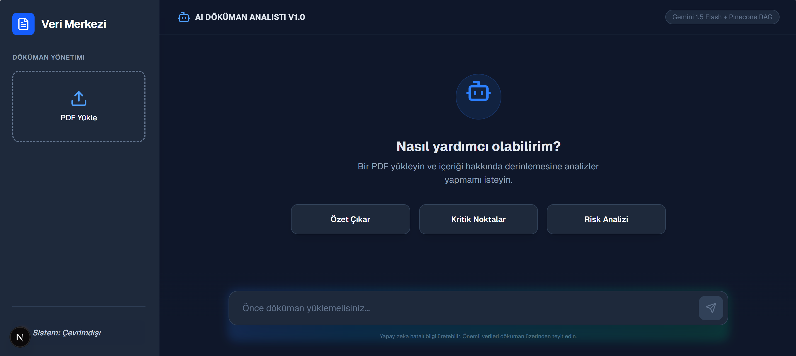
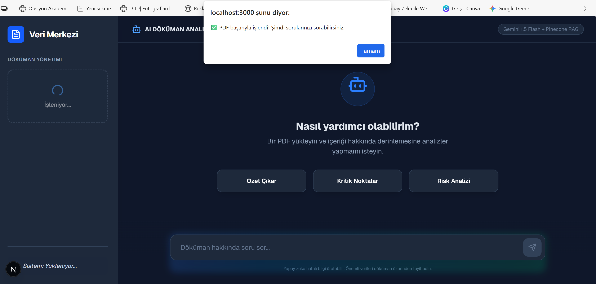

AI-Powered PDF Analyzer & Chat

<p align="center">
  
</p>

Bu uygulama, **Retrieval-Augmented Generation (RAG)** mimarisi kullanarak PDF belgeleri üzerinde akıllı analizler ve bağlamsal sohbet imkanı sunan profesyonel bir asistan aracıdır.

---

Uygulama Arayüzü

Uygulama, modern bir arayüz ile PDF belgelerinizi saniyeler içinde işler, semantik olarak indeksler ve analize hazır hale getirir.

<p align="center">
  
</p>

---

Öne Çıkan Özellikler

- Akıllı Analiz:** PDF dokümanlarından anında özet çıkarır, kritik noktaları listeler ve otomatik risk analizi yapar.
- Bağlamsal Bellek:** Pinecone Vektör Veritabanı entegrasyonu sayesinde doküman içeriğini semantik (anlamsal) olarak sorgular.
- Yüksek Performanslı AI:** Google Gemini 1.5 Flash modeli kullanılarak optimize edilmiş, hızlı ve isabetli yanıtlar sunar.
- Kullanıcı Dostu Arayüz:** Tailwind CSS ile geliştirilmiş, karanlık mod destekli modern ve akıcı tasarım.

---

Teknik Stack

- Framework:** Next.js 14 (App Router)
- AI Model:** Google Gemini 1.5 Flash
- Vector Store:** Pinecone DB
- Language:** TypeScript & Tailwind CSS
- Dosya İşleme:** PDF-Parse & LangChain Mantığı

---

API Limitleri ve Performans Notu

Proje, geliştirme aşamasında **Google AI Studio Ücretsiz API** katmanını kullanmaktadır. Bu kapsamda:

Rate Limits:** Ücretsiz kotaya bağlı olarak saniyede yapılabilecek istek sayısı sınırlıdır. Hız sınırına takılmanız durumunda lütfen 30-60 saniye bekleyip tekrar deneyiniz.
Dosya Boyutu:** Kararlı bir deneyim ve hızlı işleme için 5MB altındaki PDF dosyalarının kullanılması önerilir.
Mühendislik Notu:** Üretim (Production) ortamında bu limitler, Redis tabanlı "rate-limiting" veya ücretli API planları ile optimize edilebilir.

---

Kurulum

1. Bağımlılıkları Yükleyin:**

    ```bash
    npm install
    ```

2. Ortam Değişkenlerini Ayarlayın:**
    `.env.example` dosyasını `.env.local` olarak kopyalayın ve Google AI Studio ile Pinecone anahtarlarınızı ekleyin.

3. Projeyi Başlatın:**
    ```bash
    npm run dev
    ```

---

Lisans

Bu proje MIT Lisansı ile korunmaktadır.
